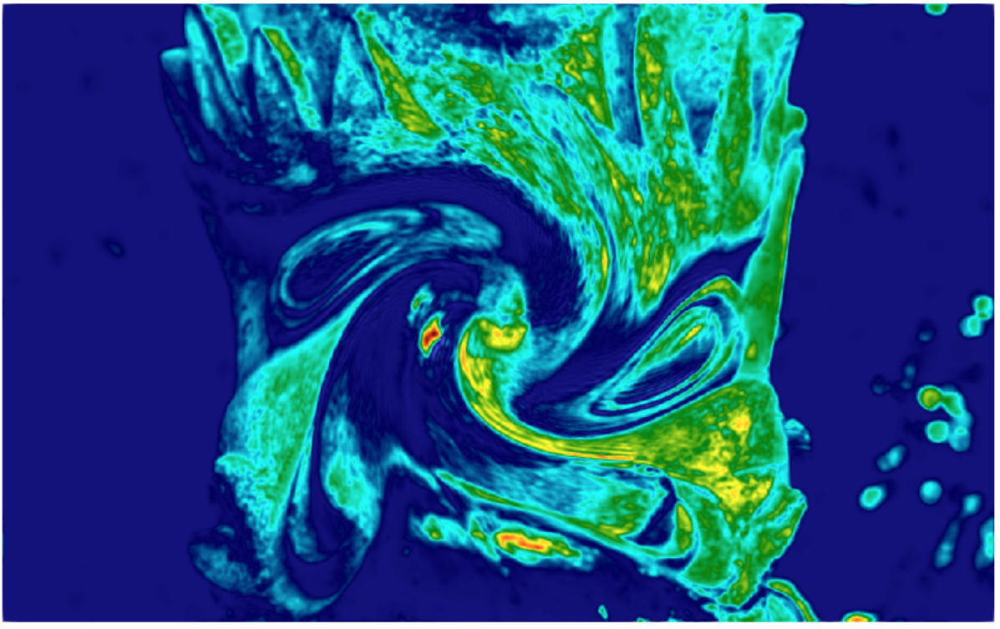

This tutorial presents an example of how to use R for initialization of simulation.

## To run it

```.sh
make configure
./configure --enable-rinside # don't forget to add --other-flags-you-use
tools/install.sh --rpackage 'png'  
# alternatively one can install the package from R console: $ `install.packages("png")`
make advection_diffusion2D_fields
CLB/advection_diffusion2D_fields/main example/runr/advection_diffusion_fields.xml
```

## What it does

It is a simple example of adding to a model (in this case `advection_diffusion2D`) the capability to be initialized from "parametric" fields. 
By parametric field, we mean any field which is accessible only in a said lattice node (doesn't have a stencil). 
Such parametric fields, can be declared with `parameter=TRUE` argument to `AddField` or `AddDensity`. 
From the perspective of the code they are easier to operate on, as writing to them doesn't require exchange of information through MPI.

Such "parametric" fields can be accessed through `RunR`, and in turn used for setting custom profiles of velocities, densities, phasefields, etc. The example file executes the following R code:

```.R
library(png)
tab = readPNG("example/data/japan.png")
```

Reads the png (requires `png` package)

```.R
nx = dim(tab)[2]
ny = dim(tab)[1]
v = as.vector(tab[,,3]^3)
x = round(as.vector(Solver$Geometry$X) - 0.5) %% nx
y = round(as.vector(Solver$Geometry$Y) - 0.5) %% ny
Solver$Fields$phi0[] = v[(ny - 1 - y) + ny*x + 1]
```

Writes the third (blue) component of the png to the field `phi0` (raised to the third power, for contrast).
One could do `Solver$Fields$phi0[] = tab[,,3]`, but that would not cope with the orientation and potential MPI division.

```.R
R = 100
maxu = 0.01
x = Solver$Geometry$X - 512
y = Solver$Geometry$Y - 320
r = sqrt(x^2+y^2)
w = exp(-r^2/(2*R^2)) / (exp(-1/2)*R) * maxu
Solver$Fields$ux[] =  y * w
Solver$Fields$uy[] = -x * w
```

Calculates and sets the advection velocities fields `ux` and `uy` with a vortex around middle of the domain.

```.R
Solver$Actions$InitFromFields() # Initiate phi from phi0
```

Executes the `InitFromFields` action, which in this case just does `phi=phi0`

<center>  </center>

<center>  </center>
