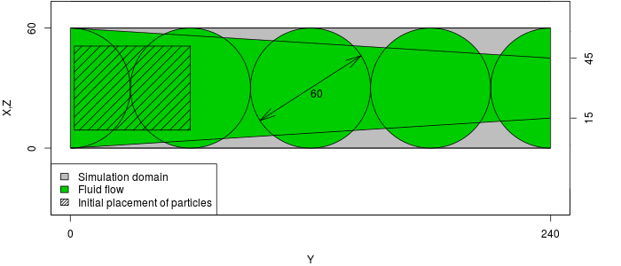

# Particles in a Pipe

!!! warning
	All these features related to particles are supported only in the
	[particle](https://github.com/llaniewski/TCLB/tree/particles) branch

## Case

The case consists of 5 balls of radious 30, placed along Y axis, connected
by a narrowing cone, like on a picture:



The particles will be placed in the wide section, and driven by the force
applied to the flow.

## Geometry

We will use the OpenSCAD software to create the geometry. It will consist of
four balls connected by a narrowing channel.

### OpenSCAD

You can install OpenSCAD with:
```bash
sudo apt install openscad
```

The OpenSCAD allow us to create geometries with a script.

```scad
R=30;
D=60;
translate([R,0,R]) {
    sphere(d=R*2);
    for (x=[1:4]) {
        translate([0,x*D,0]) {
            sphere(d=R*2);
        }
    }
    rotate([-90,0,0]) cylinder(h=8*R,r1=R,r2=R/2);
    rotate([90,0,0]) cylinder(h=3*R,r1=R,r2=R);
    translate([0,4*D,0]) rotate([-90,0,0]) cylinder(h=3*R,r1=R,r2=R);
}
```

You should get a geometry like this:

<div class="sketchfab-embed-wrapper"><iframe width="640" height="480" src="https://sketchfab.com/models/57273635273048f38e91f19f42586195/embed" frameborder="0" allowvr allowfullscreen mozallowfullscreen="true" webkitallowfullscreen="true" onmousewheel=""></iframe>

<p style="font-size: 13px; font-weight: normal; margin: 5px; color: #4A4A4A;">
    <a href="https://sketchfab.com/models/57273635273048f38e91f19f42586195?utm_medium=embed&utm_source=website&utm_campain=share-popup" target="_blank" style="font-weight: bold; color: #1CAAD9;">Pipe test-case for TCLB</a>
    by <a href="https://sketchfab.com/llaniewski?utm_medium=embed&utm_source=website&utm_campain=share-popup" target="_blank" style="font-weight: bold; color: #1CAAD9;">Ł Łaniewski-Wołłk</a>
    on <a href="https://sketchfab.com?utm_medium=embed&utm_source=website&utm_campain=share-popup" target="_blank" style="font-weight: bold; color: #1CAAD9;">Sketchfab</a>
</p>
</div>

From OpenSCAD you can export into several file formats. Export an
ASCII STL file "pipe_txt.stl". Sadly, it is rare for any software to support ASCII STL
files (which is also the case with TCLB). To create both binary stl file and
MSH file for ESYS-Particle with a util program provided with TCLB:

```bash
tools/stlutil -f pipe_txt.stl -o pipe.stl
tools/stlutil -f pipe_txt.stl -o pipe.msh
```

## ESYS-Particle simulation

!!! note
	For installation of ESYS-Particle, please refer to the [reference](/2.-Installation/ESYS-Particle/)

### Configuration
The ESYS-Particle is simulation is set up in a python script "pipe.py". At
the begining of the script we have to initialize the `sim` object:

```python
from esys.lsm import *
from esys.lsm.util import Vec3, BoundingBox
from esys.lsm.geometry import *

sim = LsmMpi(numWorkerProcesses=1, mpiDimList=[1,1,1])
sim.initNeighbourSearch( particleType="RotSphere", gridSpacing=38, verletDist=0.7 )
sim.setSpatialDomain(
	BoundingBox(Vec3(0,0,0), Vec3(64,240,64)),
	circDimList = [False, False, False]
)
sim.setTimeStepSize(1)
sim.setNumTimeSteps(10000)
```

First we read in the mesh:

```python
sim.readMesh(
	fileName = "pipe.msh",
	meshName = "floor_mesh_wall"
)
```

Then we add a set of particles, randomly packed in a rectangle:

```python
geoRandomBlock = RandomBoxPacker(
            minRadius = 4.0000,
            maxRadius = 15.0000,
            cubicPackRadius = 11.0000,
            maxInsertFails = 1000,
            bBox = BoundingBox(
            Vec3(9.0000, 2.0000, 9.0000),
            Vec3(51.0000, 60.0000, 51.0000)
	),
	circDimList = [False, False, False],
	tolerance = 1.0000e-05
)
geoRandomBlock.generate()
geoRandomBlock_particles = geoRandomBlock.getSimpleSphereCollection()
```

We add friction interaction between particles:

```python
normalK = 3;
sim.createInteractionGroup (
	RotFrictionPrms (
		name = "friction",
		normalK = normalK,
		dynamicMu = 0.6,
		shearK = normalK/10.0,
		staticMu = 0.6,
		scaling = True
	)
)
```

and elastic interaction between particles and mesh wall:

```python
sim.createInteractionGroup (
	NRotElasticTriMeshPrms (
		name = "floorWall_repell",
		meshName = "floor_mesh_wall",
		normalK = normalK
	)
)
```

To start up the movement we add a small acceleration ($10^{-5}$):

```python
sim.createInteractionGroup (
	GravityPrms (
		name = "gravity",
		acceleration = Vec3(0.0000, 1e-5, 0.0000)
	)
)
```

To visualize the results, we add a check-pointer, which will write dump
files:

```python
sim.createCheckPointer (
	CheckPointPrms (
		fileNamePrefix = "flow_data",
		beginTimeStep = 0,
		endTimeStep = 20000,
		timeStepIncr = 100
	)
)
```

Finnaly, we finish the "pipe.py" file with the execution of the simulation:

```python
sim.run()
```

### Running ESYS-Particle

We declared that we will use 1 worker process. ESYS works in a master-slave
architecture, where master process is a python interpreter. That means that
we need to run our simulation with two processes:

```bash
mpirun -np 2 esysparticle pipe.py
```

!!! note "Post-Processing"
	To learn how to post-process results from ESYS-Particle please refer
	to [another section of this manual](/4.-Post-processing/particles/)

## TCLB Simulation

The fluid flow simulation will be a simple periodic flow in a pipe with
gravity force.

To run the example we will use the `d3q27_cumulant_part` model.

```bash
make -j 4 d3q27_cumulant_part
```

!!! note "Compilation"
	For instructions on how to compile and run TCLB please refer to the
	[Getting Started guide](/1.-Getting-started/installation/)

### Configuration

Like any TCLB configuration (`pipe.xml`) we start with declaring the output directory,
size of domain and initialize the domain with the collision operator:
```xml
<CLBConfig version="2.0" output="output/3D/">
        <Geometry nx="64" ny="240" nz="64">
		<MRT><Box/></MRT>
```

Now we can add our STL geometry. We want mark all elements *outside* of the
geometry with `Wall` elements (and switch off collision):
```xml
                <Wall mask="ALL">
                       <STL file="pipe.stl" side="out"/>
                </Wall>
```

We now close the geometry element and begin to set up the simulation
settings:
```xml
        </Geometry>
        <Model>
                <Params ForceY="0.0001"/>
                <Params omega="1.0"/>
	</Model>
```

After that we have everything ready. We can declare what output we need and
how many iterations we wan to execute:
```xml
        <Failcheck Iterations="1000"/>
        <VTK/>
        <VTK Iterations="1000" what="U,Solid"/>
        <Solve Iterations="10000"/>
</CLBConfig>
```

### Running TCLB

If we are running on GPU, at this stage we can use a single GPU:
```bash
CLB/d3q27_cumulant_part/main pipe.xml
```

If you are running on CPU, it's probably best to use all the avaliable CPU
cores:
```bash
mpirun -np 4 CLB/d3q27_cumulant_part/main pipe.xml
```

### Results

In ParaView you can inspect the results. The initiali VTK drop includes all
fields, which means that you can check if the boudaries are in the right
places etc. You can also check what is the maximal velocity.

## Combining TCLB and ESYS simulations

### Configuration

To combine the two simulations we add the `<RemoteForceInterface>` element
to the configuration file (say `pipe_dem.xml`) to the `<Model>` container.
This will include our settings for the particle simulation:

```xml
		<RemoteForceInterface Iterations="10000" particle="RotSphere" verletDist="0.7" gridSpacing="38">
sim.readMesh(
	fileName = "pipe.msh",
	meshName = "floor_mesh_wall"
)

geoRandomBlock = RandomBoxPacker(
	minRadius = 4.0000,
	maxRadius = 15.0000,
	cubicPackRadius = 11.0000,
	maxInsertFails = 1000,
	bBox = BoundingBox(
	Vec3(9.0000, 2.0000, 9.0000),
	Vec3(51.0000, 60.0000, 51.0000)
	),
	circDimList = [False, False, False],
	tolerance = 1.0000e-05
	)
geoRandomBlock.generate()
geoRandomBlock_particles = geoRandomBlock.getSimpleSphereCollection()
sim.createParticles(geoRandomBlock_particles)
sim.setParticleDensity (   tag = 0,   mask = -1,   Density = 2.0)

normalK = 3;

sim.createInteractionGroup (
	RotFrictionPrms (
		name = "friction",
		normalK = normalK,
		dynamicMu = 0.6,
		shearK = normalK/10.0,
		staticMu = 0.6,
		scaling = True
		)
	)

sim.createInteractionGroup (
	NRotElasticTriMeshPrms (
		name = "floorWall_repell",
		meshName = "floor_mesh_wall",
		normalK = normalK
		)
	)

sim.createInteractionGroup (
	GravityPrms (
		name = "gravity",
		acceleration = Vec3(0.0000, 1e-5, 0.0000)
		)
	)

sim.createCheckPointer (
	CheckPointPrms (
		fileNamePrefix = "flow_data",
		beginTimeStep = 0,
		endTimeStep = 20000,
		timeStepIncr = 100
		)
	)
		</RemoteForceInterface>
```

We deleted the now the gravity force acting on the particles, and rely only
on the force applied to the fluid flow.

### Running TCLB and ESYS

Our simulation is set up to be executed in a Spawning approach. This means
that we will run TCLB, and TCLB will dynamically spawn ESYS-Particle code.

